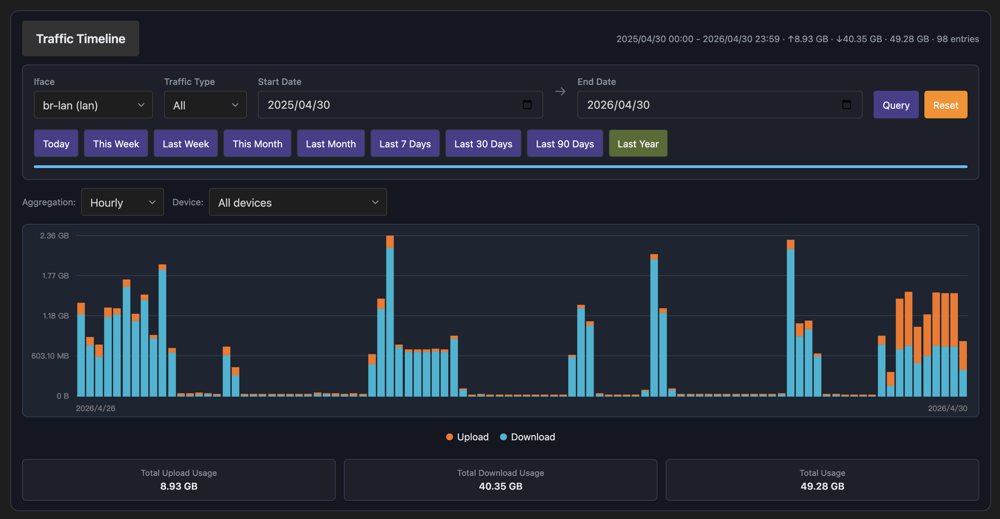

# LuCI Bandix Plus

> Recommended for **multi-interface** setups.
> For **single-interface** setups, see [LuCI Bandix](https://github.com/timsaya/luci-app-bandix).

English | [简体中文](README.zh.md)

[](LICENSE)


## Overview

LuCI Bandix Plus is a LuCI frontend for `bandix-plus`, designed for OpenWrt traffic monitoring and rate control.
Compared with `luci-app-bandix`, **LuCI Bandix Plus focuses on multi-interface scenarios**.


This project provides a web UI under **Network → Bandix Plus** to view and manage:

- Multi-interface monitoring and management
- Interface overview (upload / download)
- Device list and usage ranking
- Traffic timeline and historical statistics
- Interface rate limits
- Scheduled rate limits
- Guest control rules and whitelist

Typical interfaces include physical ports, VLAN sub-interfaces, PPPoE WAN, and VPN/tunnel interfaces.

## Screenshots




## Requirements

- OpenWrt with LuCI
- `bandix-plus` backend service installed and running
- Linux kernel with eBPF support

Recommended:

- Disable hardware flow offloading / Turbo ACC before using traffic statistics features.

## Installation

1. Install `openwrt-bandix-plus` backend first

   Download the appropriate package for your device from [openwrt-bandix-plus Releases](https://github.com/timsaya/openwrt-bandix-plus/releases), then install:

   ```bash
   opkg install bandix-plus_*.ipk  # (or apk add --allow-untrusted bandix-plus_*.apk)
   ```

2. Install `luci-app-bandix-plus` frontend

   Download the package from [luci-app-bandix-plus Releases](https://github.com/timsaya/luci-app-bandix-plus/releases), then install:

   ```bash
   opkg install luci-app-bandix-plus_*.ipk  # (or apk add --allow-untrusted luci-app-bandix-plus_*.apk)
   ```

After installation:

1. Open LuCI: **Network → Bandix Plus**
2. Configure monitored interfaces
3. Ensure `bandix-plus` service is enabled

## Notes

- This package depends on: `luci-base`, `luci-lib-jsonc`, `curl`, `bandix-plus`.


## Team Members

- [timsaya](https://github.com/timsaya)
- [smallprogram](https://github.com/smallprogram)


## License

Apache 2.0. See [LICENSE](LICENSE).
